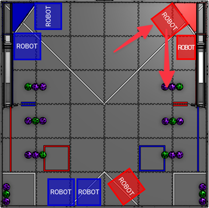

# FTC DECODE (2025-2026) Ranking Points Guide

**Last Updated:** 2025-01-15
**Competition Manual Version:** TU18
**Applies To:** All FTC teams competing in DECODE season
**Official Source:** [DECODE Competition Manual](https://ftc-resources.firstinspires.org/ftc/game/cm-html/DECODE_Competition_Manual_TU18.htm)

---

## Purpose

This guide explains **Ranking Points (RP)** — the primary metric used to rank teams during Qualification matches in the DECODE season. Understanding how to earn RPs consistently is essential for advancing to playoffs, even more important than winning individual matches by large margins.

---

## What Are Ranking Points?

Ranking Points reward **consistent performance across specific game objectives**, separate from match points (which determine who wins each match).

| Concept | Description |
|---------|-------------|
| **When Earned** | At the end of each Qualification match |
| **Maximum per Match** | 3 RP (one from each category) |
| **How Teams Rank** | By **average RP** across all matches played |
| **Perfect Average** | 3.0 RP (earning all 3 RPs every match) |

**Key Insight:** A team with a 2.5 RP average will rank higher than a team with a 1.8 RP average, even if the second team won some matches by larger point margins.

---

## The Three RP Categories

Each match, your alliance can earn up to **3 Ranking Points** by meeting these thresholds:

| RP Category | Threshold | What It Measures |
|-------------|-----------|------------------|
| **Movement RP** | 16+ points from movement actions | Robot mobility & endgame coordination |
| **Goal RP** | 36+ artifacts scored in goal | Offensive capability & cycle time |
| **Pattern RP** | 18+ points from pattern matching | Strategic/sensor skills & coordination |

---

## 1. Movement RP (16+ Points)

Movement RP rewards **reliable autonomous driving** and **endgame coordination**.

### Scoring Actions

| Action | Points | Period | Notes |
|--------|--------|--------|-------|
| **LEAVE** | 3 pts | AUTO | Robot fully exits Launch Zone by end of AUTO |
| **Partial BASE return** | 5 pts | TELEOP end | Any part of robot in Base Zone |
| **Full BASE return** | 10 pts | TELEOP end | Robot completely within Base Zone |
| **Both robots fully in BASE** | +10 pts bonus | TELEOP end | Alliance coordination bonus |

### Understanding LEAVE

**LEAVE Definition:** A scoring accomplishment in which a robot must move such that it is **no longer over any LAUNCH LINE** at the end of AUTO.

- **Launch Zones** are the white triangular areas in the field corners
- Robots start **inside** these triangular zones
- To score LEAVE (3 pts), the robot must **completely exit** the triangular Launch Zone by the end of the 30-second AUTO period
- Even a simple "drive forward for 2 seconds" autonomous can achieve this

### Reaching 16 Points (Threshold)

| Strategy | Points |
|----------|--------|
| Both robots LEAVE | 6 pts |
| Both robots fully return to BASE | 20 pts |
| **Total** | **26 pts** ✓ |

**Minimum viable path:**
- Both robots LEAVE (6 pts) + both partial BASE returns (10 pts) = **16 pts** ✓
- One robot LEAVE (3 pts) + both full BASE returns (20 pts) = **23 pts** ✓

### Tips for Earning Movement RP

1. **Prioritize a working AUTO** — Even a basic "drive forward" auto earns 3 pts
2. **Practice BASE returns** — Coordinate with alliance partner on approach angles
3. **Use the final 20 seconds wisely** — BASE return must happen at match end
4. **Full is better than partial** — 10 pts vs 5 pts makes a big difference

---

## 2. Goal RP (36+ Artifacts)

Goal RP tests your **cycle time efficiency** — how quickly you can collect and score artifacts.

### Scoring Actions

| Scoring Type | Points | Description |
|--------------|--------|-------------|
| **CLASSIFIED** | 3 pts per artifact | Artifact enters goal through the Classifier square |
| **OVERFLOW** | 1 pt per artifact | Artifact enters goal directly (not through Classifier) |

### Important: It's About Quantity, Not Points!

For Goal RP, you need **36 total artifacts** in the goal (CLASSIFIED + OVERFLOW combined), regardless of how many points they're worth.

### Math for Goal RP

| Calculation | Value |
|-------------|-------|
| Threshold | 36 artifacts |
| TELEOP duration | 120 seconds |
| Alliance robots | 2 |
| **Artifacts per robot per second** | 36 ÷ 2 ÷ 120 = **0.15** |
| **Seconds per artifact per robot** | **~6.7 seconds** |

Each robot needs to score approximately **1 artifact every 6.7 seconds** to reach the threshold.

### Strategy Considerations

| Approach | Pros | Cons |
|----------|------|------|
| **OVERFLOW focus** | Faster cycle time, easier to execute | Lower match points (1 pt each) |
| **CLASSIFIED focus** | Higher match points (3 pts each) | Slower, requires Classifier navigation |
| **Mixed approach** | Balances speed and points | Requires driver skill switching |

**For Goal RP specifically:** Volume matters more than precision. OVERFLOW scoring is often faster.

### Tips for Earning Goal RP

1. **Optimize intake mechanism** — Fast pickup = more cycles
2. **Practice efficient driving paths** — Minimize travel time
3. **Coordinate with alliance partner** — Avoid traffic jams
4. **Track your pace** — If you're below 1 artifact per 7 seconds, speed up

---

## 3. Pattern RP (18+ Points)

Pattern RP rewards **autonomous sensing capability** and **strategic artifact placement**.

### How Pattern Scoring Works

1. **The Motif** — A randomized color sequence (GPP, PGP, or PPG) displayed on the Obelisk via AprilTags
2. **The Ramp** — Holds up to 9 artifacts at a time
3. **Pattern Matching** — Each artifact in the correct color sequence position earns 2 points

### Scoring Checkpoints

Pattern scoring is evaluated at **two specific moments**:

| Checkpoint | When | Max Artifacts | Max Points |
|------------|------|---------------|------------|
| End of AUTO | 30-second mark | 9 | 18 pts |
| End of TELEOP | Match end | 9 | 18 pts |
| **Total Maximum** | — | — | **36 pts** |

### Reaching 18 Points (Threshold)

| Path to 18 Points | How |
|-------------------|-----|
| Max out AUTO only | 9 correct patterns × 2 pts = 18 pts ✓ |
| Max out TELEOP only | 9 correct patterns × 2 pts = 18 pts ✓ |
| Split across periods | e.g., 5 AUTO + 4 TELEOP = 18 pts ✓ |

### Decoding the Motif

The Obelisk displays the motif using AprilTags:

| AprilTag ID | Location | Use |
|-------------|----------|-----|
| 21 | Obelisk Face 1 | Decode motif |
| 22 | Obelisk Face 2 | Decode motif |
| 23 | Obelisk Face 3 | Decode motif |

**Note:** Obelisk tags should NOT be used for robot navigation — only for reading the motif pattern.

### Strategic Approaches

| Strategy | Description | Best For |
|----------|-------------|----------|
| **AUTO-focused** | Load ramp during autonomous, score 18 pts early | Teams with strong vision code |
| **TELEOP-focused** | Fill ramp during driver control | Teams with reliable drivers |
| **Balanced** | Score some in each period | Redundancy and reliability |

### Tips for Earning Pattern RP

1. **Implement AprilTag reading in AUTO** — Decode the motif early
2. **Communicate the pattern to drivers** — Display on Driver Station or memorize
3. **Coordinate ramp usage** — Only your alliance can operate your gate
4. **Practice pattern sequences** — Know G, P, G order by muscle memory

---

## How RPs Affect Tournament Ranking

During Qualification matches, teams are ranked by (in order):

| Priority | Metric | Description |
|----------|--------|-------------|
| 1st | **Average Ranking Points** | Total RPs ÷ Matches played |
| 2nd | **Match Points** (tiebreaker) | Excluding opponent fouls |
| 3rd | **Base Points** (2nd tiebreaker) | Points from BASE returns |
| 4th | **Auto Points** (3rd tiebreaker) | Points scored during AUTO |
| 5th | **Random Selection** | Final tiebreaker |

**Example Rankings:**

| Team | Matches | Total RP | Avg RP | Rank |
|------|---------|----------|--------|------|
| Team A | 5 | 13 | 2.6 | 1st |
| Team B | 5 | 12 | 2.4 | 2nd |
| Team C | 5 | 10 | 2.0 | 3rd |

---

## Quick Reference Card

### All Three RPs at a Glance

| RP | Threshold | Realistic Alliance Path |
|----|-----------|------------------------|
| **Movement** | 16+ pts | Both LEAVE (6) + both full BASE (20) = 26 ✓ |
| **Goal** | 36 artifacts | ~18 artifacts per robot over 2 min |
| **Pattern** | 18+ pts | 9 correct placements in either period |

### Match Checklist

**Before Match:**
- [ ] Verify AUTO program drives out of Launch Zone (LEAVE)
- [ ] Coordinate BASE return strategy with alliance partner
- [ ] Confirm vision system can read Obelisk AprilTags

**During AUTO (30 sec):**
- [ ] Execute LEAVE (exit Launch Zone)
- [ ] Decode motif if possible
- [ ] Score pattern on ramp if capable

**During TELEOP (2 min):**
- [ ] Maintain artifact cycle pace (~1 per 7 sec per robot)
- [ ] Score correct pattern sequence on ramp
- [ ] **Final 20 seconds:** Return to BASE Zone

**End of Match:**
- [ ] Both robots fully in BASE (10 pts each + 10 bonus)

---

## Strategy Matrix: Prioritizing RPs

Not all teams can earn all 3 RPs every match. Here's a priority guide based on team capabilities:

### Beginner Teams (Focus: Movement RP)

| Priority | RP | Why |
|----------|-----|-----|
| 1st | Movement | Easiest to achieve with basic AUTO and driver practice |
| 2nd | Goal | Volume scoring doesn't require precision |
| 3rd | Pattern | Requires vision + coordination (add later) |

**Minimum viable robot:**
- Drive out of Launch Zone in AUTO (LEAVE)
- Return to BASE at match end
- Score OVERFLOW artifacts for volume

### Intermediate Teams (Focus: Movement + Goal)

| Priority | RP | Why |
|----------|-----|-----|
| 1st | Movement | Should be reliable at this point |
| 2nd | Goal | Optimize cycle time and driver efficiency |
| 3rd | Pattern | Add vision-based scoring |

### Advanced Teams (Target: All Three)

| Priority | RP | Why |
|----------|-----|-----|
| 1st | All | Consistent 3 RP average separates top teams |
| Focus | Pattern | Often the differentiator in competitive events |

---

## Common Mistakes to Avoid

| Mistake | Impact | Solution |
|---------|--------|----------|
| No AUTO program | Lose 3 pts LEAVE | Implement basic "drive forward" AUTO |
| Forgetting BASE return | Lose 5-20 pts | Set driver station timer reminder |
| Racing to BASE too early | Less scoring time | Wait until final 15-20 seconds |
| Ignoring pattern scoring | Miss up to 36 pts | Add Obelisk AprilTag reading |
| Traffic jams with partner | Slow cycle time | Pre-match coordination |
| Only focusing on match wins | Lower ranking | RPs matter more than point margins |

---

## Learning Path

For teams new to FTC competition strategy:

### Level 1: Understand the Basics
- Read this guide thoroughly
- Watch match videos from prior DECODE events
- Understand the difference between match points and ranking points

### Level 2: Implement Movement RP
- Create a basic AUTO that achieves LEAVE
- Practice BASE returns in driver practice
- Target: Consistent Movement RP every match

### Level 3: Add Goal RP
- Time your artifact cycles
- Optimize driving paths
- Target: 36+ artifacts with alliance partner

### Level 4: Master Pattern RP
- Implement AprilTag vision for Obelisk reading
- Practice pattern sequences
- Target: All 3 RPs consistently

### Resources

- [FTC Official Documentation](https://ftc-docs.firstinspires.org/)
- [DECODE Competition Manual](https://ftc-resources.firstinspires.org/ftc/game/cm-html/DECODE_Competition_Manual_TU18.htm)
- [FTC Game Q&A Forum](https://ftc-qa.firstinspires.org/)
- [FTC Community Forum](https://ftc-community.firstinspires.org/)
- [Game Manual & Team Updates](https://ftc-resources.firstinspires.org/ftc/game)

---

## Related Guides

| Guide | Location | Description |
|-------|----------|-------------|
| AutoMode Guide | `../programming/AutoMode-Guide-DECODE-NoIntake.md` | Implementing autonomous for LEAVE |
| AprilTag Vision | `../vision/AprilTag-Vision-Guide.md` | Reading Obelisk tags for Pattern RP |
| Mecanum Drive | `../drivetrain/Mecanum-Drive-Guide.md` | Efficient driving for Goal RP |

---

## Revision History

| Date | Version | Changes |
|------|---------|---------|
| 2025-01-15 | 1.0 | Initial version based on Competition Manual TU18 |
